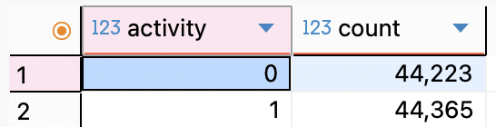
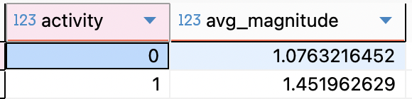
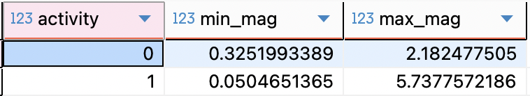
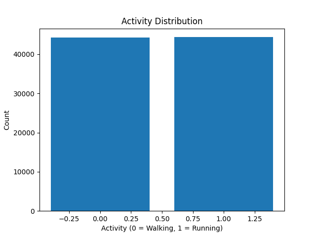
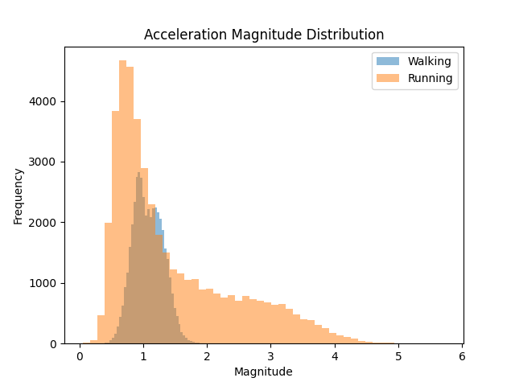
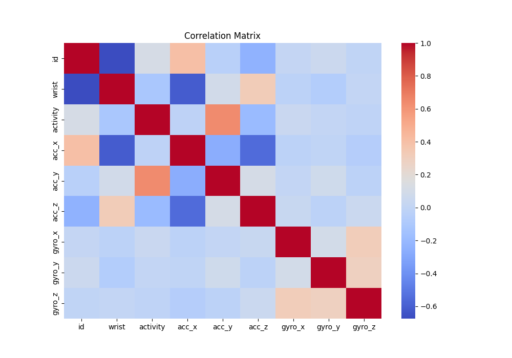
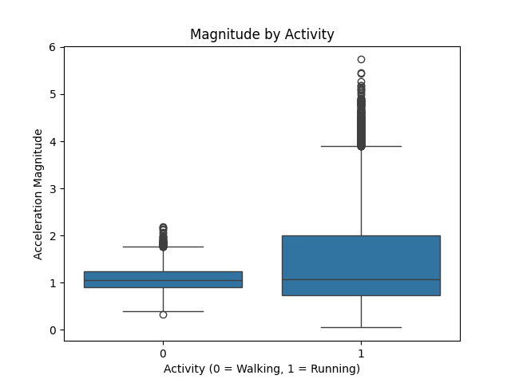
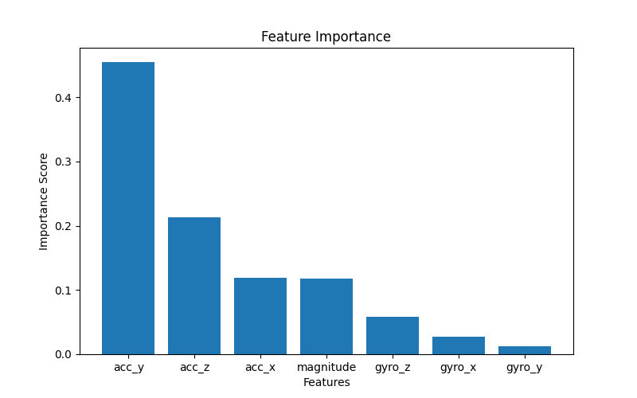

# IoT Motion Data Analytics

## Project Overview

This project analyzes motion sensor data collected from a wearable device using accelerometer and gyroscope signals.  
The goal is to explore how motion patterns differ between walking and running activities using SQL-based analysis and Python-based Exploratory Data Analysis (EDA).

This project follows an end-to-end analytics workflow:

SQL → Python EDA → Feature Engineering → Machine Learning → Dashboarding

---

## Dataset

This project uses the **Kinematics Motion Dataset**, which contains motion sensor data collected from a wearable device.

- Source: [Kaggle - Kinematics Motion Dataset](https://www.kaggle.com/datasets/yasserh/kinematics-motion-data)  
- Total Records: 88,588  

### Features:
- Acceleration (X, Y, Z)
- Gyroscope (X, Y, Z)
- Activity (0 = Walking, 1 = Running)
- Timestamp (Date & Time)
- User
- Wrist

---

## SQL Analysis

All SQL queries used in this project can be found here:  
[SQL Analysis File](sql/sql_analysis.sql)

### Analyses performed:
- Activity distribution analysis
- Sensor data aggregation (average acceleration)
- Feature engineering (acceleration magnitude)
- Motion variability analysis (min-max range)

---

## SQL Results

### 1. Activity Distribution

The dataset is balanced between walking and running activities.

---

### 2. Acceleration Magnitude

Running shows higher acceleration magnitude, indicating more intense and dynamic movement compared to walking.

---

### 3. Magnitude Range

Running exhibits a wider range of acceleration values, suggesting higher variability in motion patterns.

---

## Python Analysis (EDA)

The dataset was further analyzed using Python (Pandas, Matplotlib, and Seaborn) after being queried from PostgreSQL.

---

### Activity Distribution

This visualization confirms that the dataset is balanced between walking and running activities.

---

### Acceleration Magnitude Distribution

Running shows higher and more widely distributed acceleration magnitude values, indicating more dynamic movement patterns.

---

### Correlation Analysis

Correlation analysis shows relationships between accelerometer, gyroscope, and activity features.

`acc_y` shows the strongest relationship with activity classification, indicating it may be one of the most important features for distinguishing walking and running.

---

### Magnitude Comparison by Activity

Running activity shows a wider and higher acceleration magnitude distribution compared to walking, suggesting greater motion intensity and variability.

This supports the idea that acceleration magnitude is a strong engineered feature for activity classification.

---

## Machine Learning Analysis

### Logistic Regression

Logistic Regression was used as the baseline classification model.

Accuracy achieved:

**94.8%**

This shows that sensor-based features are highly effective for distinguishing walking and running activities.

---

### Confusion Matrix

The confusion matrix confirms strong class separation between walking and running activities.

- Walking correctly classified: 8653
- Running correctly classified: 8136

The model shows strong performance with low misclassification rates.

---

### Random Forest Model

Random Forest significantly improved model performance.

Accuracy achieved:

**99.0%**

This indicates that the dataset is highly suitable for classification and that the selected features are strongly predictive.

---

### Feature Importance

Feature importance analysis shows that:

- `acc_y` is the most important feature
- acceleration-based features are more important than gyroscope features
- magnitude remains a strong engineered feature

This confirms the findings from the EDA stage and strengthens the overall project results.

---

## Key Insights

- Running involves higher motion intensity than walking  
- `acc_y` is the strongest feature for activity classification  
- Acceleration magnitude is an effective engineered feature for distinguishing activities  
- Running has more dynamic and variable motion patterns  
- Logistic Regression achieved strong baseline performance with 94.8% accuracy  
- Random Forest significantly improved classification performance with 99.0% accuracy  
- Acceleration-based features are more important than gyroscope features  
- SQL, Python EDA, and Machine Learning analyses are consistent and support each other  

---

## Tools Used

- PostgreSQL  
- DBeaver  
- SQL  
- Python (Pandas, Matplotlib, Seaborn, Scikit-learn)  
- Jupyter Notebook  
- Machine Learning (Logistic Regression, Random Forest)  

---

## Future Improvements

- Model evaluation using precision, recall, and F1-score  
- Hyperparameter tuning for Random Forest optimization  
- Interactive dashboard using Tableau or Power BI  
- Real-time motion data processing (optional extension)  
- Deployment-ready analytics workflow  
